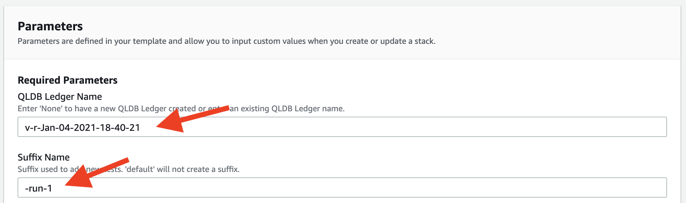

# Amazon QLDB Data Simulation Tool

**WARNING**: This guide is for demonstration purposes only and should only be used in a development or test AWS environment. Elevated IAM privileges are used.

### Region Selection

This workshop can be deployed in any AWS region that supports the following services:

- Amazon QLDB
- AWS Lambda
- AW Stepfunctions
- AWS CloudFormation

You can refer to the [region table](https://aws.amazon.com/about-aws/global-infrastructure/regional-product-services/) in the AWS documentation to see which regions have the supported services.

## Implementation Instructions

Each of the following sections provides an implementation overview and detailed, step-by-step instructions.

### 1. Launch CloudFormation template.

Launch one of these AWS CloudFormation templates in the Region of your choice.

Region| Launch
------|-----
US East (N. Virginia) | [](https://us-east-1.console.aws.amazon.com/cloudformation/home?region=us-east-1#/stacks/quickcreate?templateUrl=https%3A%2F%2Fqldb-streaming-lab-us-east-1.s3.amazonaws.com%2Fdev%2Fcfn_templates%2Fperf_test_cfn.yml&stackName=qldb-sim-1&param_Batch=1&param_BlobKB=0&param_ConcurrentTransactions=25&param_Count=200&param_Delete=False&param_DocRevisions=0&param_DocsPerTransaction=5&param_FrontEndEndpoint=default&param_QLDBLedgerName=None&param_RandomSalt=1&param_ReadBeforeWrite=True&param_SessionEndpoint=default&param_SuffixName=default&param_Verify=True)
US East (Ohio) | [](https://us-east-2.console.aws.amazon.com/cloudformation/home?region=us-east-2#/stacks/quickcreate?templateUrl=https%3A%2F%2Fqldb-streaming-lab-us-east-2.s3.amazonaws.com%2Fdev%2Fcfn_templates%2Fperf_test_cfn.yml&stackName=qldb-sim-1&param_Batch=1&param_BlobKB=0&param_ConcurrentTransactions=25&param_Count=200&param_Delete=False&param_DocRevisions=0&param_DocsPerTransaction=5&param_FrontEndEndpoint=default&param_QLDBLedgerName=None&param_RandomSalt=1&param_ReadBeforeWrite=True&param_SessionEndpoint=default&param_SuffixName=default&param_Verify=True)
US West (Oregon) | [](https://us-west-2.console.aws.amazon.com/cloudformation/home?region=us-west-2#/stacks/quickcreate?templateUrl=https%3A%2F%2Fqldb-streaming-lab-main.s3.amazonaws.com%2Fdev%2Fcfn_templates%2Fperf_test_cfn.yml&stackName=qldb-sim-1&param_Batch=1&param_BlobKB=0&param_ConcurrentTransactions=25&param_Count=200&param_Delete=False&param_DocRevisions=0&param_DocsPerTransaction=5&param_FrontEndEndpoint=default&param_QLDBLedgerName=None&param_RandomSalt=1&param_ReadBeforeWrite=True&param_SessionEndpoint=default&param_SuffixName=default&param_Verify=True)
EU (Frankfurt) | [](https://eu-central-1.console.aws.amazon.com/cloudformation/home?region=eu-central-1#/stacks/quickcreate?templateUrl=https%3A%2F%2Fqldb-streaming-lab-eu-central-1.s3.amazonaws.com%2Fdev%2Fcfn_templates%2Fperf_test_cfn.yml&stackName=qldb-sim-1&param_Batch=1&param_BlobKB=0&param_ConcurrentTransactions=25&param_Count=200&param_Delete=False&param_DocRevisions=0&param_DocsPerTransaction=5&param_FrontEndEndpoint=default&param_QLDBLedgerName=None&param_RandomSalt=1&param_ReadBeforeWrite=True&param_SessionEndpoint=default&param_SuffixName=default&param_Verify=True)

### 2. Fill out the CloudFormation parameters.

A "Quick create stack" page will be opened that comes pre-populated with all required inputs.

#### In the Stack name block. Leave as default or change to a unique name. 

#### In the Parameters section, notice that there are three parameter groups. 
- Required Parameters
- Simulation Parameters
- Additional Parameters
    
In the *Required Parameters* section "QLDB Ledger Name" can be used in two ways. If left as "None" then a new QLDB Ledger will be created. If an existing QLDB ledger already exists, then enter the name of the Ledger.

In Suffix Name, "default" will not create a suffix.  Entering a suffix like "run-1" will add the suffix to custom metrics and a CloudWatch dashboard. This will allow for multiple tests on the same ledger with different configurations. It is recommended to only run a single test per unique suffix. 

In the Simulation Parameters section, the parameters will determine how the simulation test is ran.  

Total Number of Iterations will determine how long the test will run. For reference, 1 iteration is equal to roughly 1.2 seconds. 

Batch Number will set how many test events each lambda function will execute. Leaving the input as 1, each lambda function will execute only 1 test event.

Concurrent QLDB Connections will set the number of concurrent lambda function executions or simultaneous test events.  25 will execute 25 lambda functions for every iteration.

Documents per Transaction. When inserting data into qldb, multiple documents can be added in a single transaction. 5 will configure 5 documents to be inserted into QLDB for every transaction. 

Extra KB 'BLOB' per Document will create a pre-defined object that is added to every QLDB document. This will allow to test QLDB against small vs large document sizes.

Revisions/Updates per Document will update each document a set number of times. 0 will not update any QLDB documents.

Read Before Write will enable a uniqueness check in QLDB and ensure that duplicate documents are not being inserted into the QLDB Ledger.

Additional Parameters

FrontEnd QLDB Endpoint can be configured to use an alternate endpoint. "default" will use the standard frontend endpoint.

Session QLDB Endpoint can be configured to use an alternate endpoint. "default" will use the standard session endpoint.

Verify can be configured to verify SSL certificates or not. 

Random Variable is only used if the CloudFormation stack is to be updated and no other parameters have changed. Changing Random Variable will force CloudFormation to update and execute a new test. 

Clean Up will delete the QLDB ledger in the "QLDB Ledger Name" filled and the corresponding CloudWatch dashboards. 

#### Capabilities section

In the Capabilities section, check "I acknowledge that AWS CloudFormation might create IAM resources."

#### Create Stack

Now click on Create stack.

Ensure that the CloudFormation stack creates with no issues.  It will only take a few minutes. 

### 3. View the metrics for the simulation test. 

In the AWS console, enter "CloudWatch" in the search bar. Click on CloudWatch.

On the left of the CloudWatch page. Click on Dashboards.

Now select the dashboard that matches you QLDB Ledger Name + suffix.  If you entered "None" then the name will follow a "v-r-<date>" format.

Take a look at the metrics and enjoy.

### 4. Run a second test.

To run a second test, head on over the CloudFormation from the AWS console search bar.

Click on the stack name created in the first section. 

Now select update.

In the Prerequisite - Prepare template block, select "Use current template" and then "Next".

In the Required Parameters section, insert the QLDB Ledger name and add a suffix. 

Click on next.

Click on next again.

In the Capabilities section, check "I acknowledge that AWS CloudFormation might create IAM resources."

Now click Update stack and the test will automatically start.

**Note** The test will only start if the previous test has completed.

License
----

MIT

